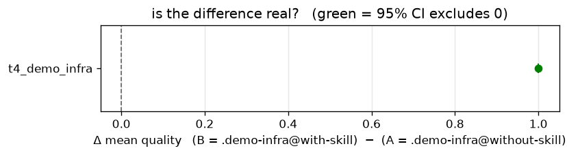
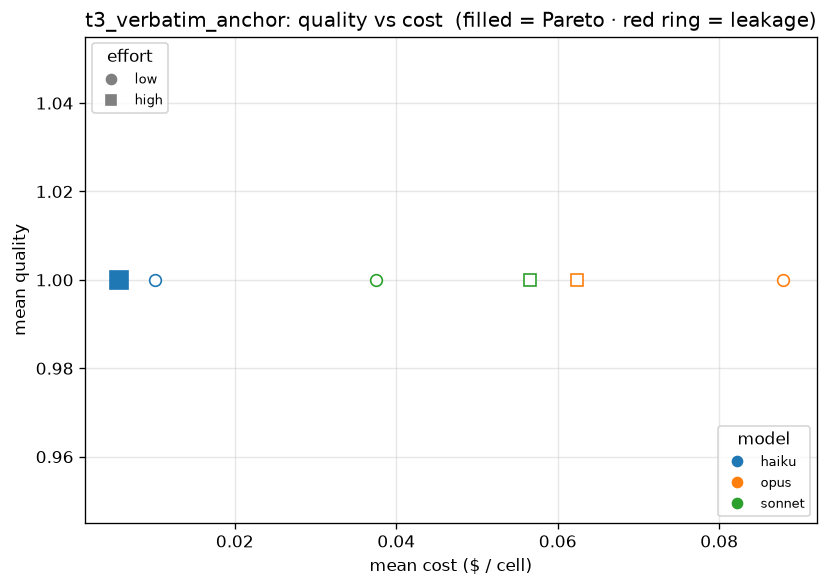

# claude-ablation-lab

[](https://github.com/brandon-behring/claude-ablation-lab/actions/workflows/ci.yml)
[](https://www.python.org/downloads/)
[](LICENSE)

A personal **model × thinking-effort × config** ablation/regression harness for **Claude Code**, run headless against *your own* use cases.

The mission is **model/effort selection economics**: measure — on *your* tasks, inside *your* infrastructure — which model × thinking-effort configs sit on the quality-vs-cost **Pareto frontier**, where the expensive reflex (opus/max) overpays, and where a cheaper config is provably safe. The goal is not to reproduce Anthropic's published base numbers. The same machinery also proves whether a change to your `CLAUDE.md` / skills / MCP / prompts **actually helps** ("is the difference real?") — that infra A/B capability exists to keep the economics measurement honest (hermetic cells, designed controls, exact verdicts). Inspired by the Anthropic talk *"Picking the right model"* (build a small private eval; optimize cheapest-per-*successful-outcome*; read your transcripts; separate infra failures from model failures); mission clarified by the [2026-07-06 independent audit](docs/audits/2026-07-06_independent-audit.md).

## How it works

- **Substrate:** drives `claude -p --model X --effort Y --output-format json` (your real agent, your subscription auth).
- **Variant = `infra_repo@ref`:** each config under test is a git ref of an infra repo, materialized as a persistent **git worktree**; the runner runs with `cwd` there, so it loads exactly that project's `CLAUDE.md`/`.claude`. Comparing two refs = commit-over-commit "did this change help?".
- **Graders:** per-task; 4 registered — AUROC classification, an external `research_toolkit` validator, and the verbatim-anchor pair (`anchor` reflow-tolerant / `anchor_strict` char-exact; ≥3-word distinct quotes only).
- **Ledger:** append-only JSONL (resumable) + sidecar transcripts; `report`/`compare` query it via **DuckDB**, with bootstrap CIs from **eval-toolkit**.

## Setup

**Prerequisites:** Python **3.13+**, `git`, the [`claude`](https://docs.claude.com/en/docs/claude-code) CLI (logged in to your subscription), and a virtualenv tool ([`uv`](https://docs.astral.sh/uv/) recommended).

```bash
uv venv --python 3.13 --seed && source .venv/bin/activate   # --seed puts pip in the venv; or: python3.13 -m venv .venv
make install      # eval-toolkit (pinned, from GitHub) + this package [dev]
make hooks        # optional: pre-commit (ruff/black @commit, mypy @pre-push)
```

Two dependencies are **public but not on PyPI**:

- **[eval-toolkit](https://github.com/brandon-behring/eval-toolkit)** — bootstrap CIs + AUROC behind the graders and `report`/`compare`. `make install` fetches a pinned release from GitHub; for editable dev pass a local checkout: `EVAL_TOOLKIT=~/eval-toolkit make install`.
- **[research_toolkit](https://github.com/brandon-behring/research_toolkit)** — only for task **T2** (its `/research-plan` validator, and as an infra-variant worktree). Optional — T1/T3 are infra-agnostic and run without it.

## Quickstart

```bash
# Smoke first — 4 cheap cells, self-contained, proves the loop end-to-end:
ablation run tasks/ grids/smoke.yaml --task t3_verbatim_anchor --ledger results/smoke.jsonl
ablation report results/smoke.jsonl

# The focused v1 sweep (63 cells = 3 tasks × valid model×effort × 3 epochs):
ablation run      tasks/ grids/v1.yaml --dry-run   # preview the expanded grid, no calls
ablation estimate tasks/ grids/v1.yaml             # run ONE cell, project tokens/turns/cost
ablation run      tasks/ grids/v1.yaml             # sequential, resumable → results/ledger.jsonl
ablation report   results/ledger.jsonl             # mean±CI, cost, latency, Pareto, leakage flag
ablation compare  results/ledger.jsonl --a repo@v1 --b repo@v2   # paired-bootstrap "is it real?"
ablation advise   results/ledger.jsonl --reflex opus/max         # cheapest config within the quality margin — $ + latency saved
ablation regrade  tasks/ --ledger results/ledger.jsonl           # re-score stored runs, no calls
ablation plot     results/ledger.jsonl --a repo@v1 --b repo@v2   # Pareto / effort / A-B forest figures
```

> **T1 prerequisite:** T1 needs a balanced `text`+`label` holdout parquet — set `$T1_HOLDOUT_PATH`
> (or drop one at `data/t1_holdout.parquet`); e.g. a split from the public MIT-licensed
> [prompt-injection-detection-prototype](https://github.com/brandon-behring/prompt-injection-detection-prototype).
> Without it the full-suite commands abort up front — **T3 (and the demo A/B below) run out of the box.**
>
> **Reproducible showcase:** the self-contained skill A/B — the harness detecting an infra
> change with an exact-test verdict — is [`examples/demo-infra/`](examples/demo-infra/README.md)
> (`grids/showcase.yaml`).

> **T2 prerequisite:** the `t2_research_plan` cells run in a worktree of the variant repo in `grids/v1.yaml` (default `~/Claude/research_toolkit@HEAD`). Two conditions must hold: the path is a worktree-able git checkout (else those cells are logged and skipped), **and the `/research-plan` skill is in the `.claude/skills/research-plan/SKILL.md` directory form — flat `.claude/skills/*.md` files do not load** (verified live: [the probe](docs/design/2026-07-01_infra-loading-probe.md)), in which case T2 *runs* — the most expensive, agentic cells — and scores ~0 for infra reasons rather than being skipped. Cells are **tool-minimal by default** (`HERMETIC_DISALLOWED_TOOLS` denies every known built-in tool but `Skill`, live-verified against the installed CLI); an agentic task like T2 declares exactly what it needs via `tools:` in its task YAML (`t2_research_plan.yaml`: `[Read, Write, Bash]`, matching the skill's own `allowed-tools` frontmatter) and the preparer relaxes just those, per-task — see [the T2 runway note](docs/design/2026-07-02_t2-runway.md) for what's still blocking an actual run (the flat-skill conversion above, and an open A/B-vs-quality-sweep decision). A real sweep also records **which tools each cell actually invoked** (`--output-format stream-json` → the ledger's `tool_calls`), not just which were allowed.

> **Cost note:** on a Max/Pro subscription there is no per-call dollar charge; `total_cost_usd` is a comparability *metric*. The real budget is **rate-limit headroom** — a big sweep can throttle your normal Claude Code work, so runs are sequential, resumable, and `estimate` warns first. A hard usage cap halts the sweep cleanly and leaves the ledger resumable.

## Results — the live showcase run (2026-07-02)

The committed [`results/showcase.jsonl`](results/showcase.jsonl) is a real, sanitized 54-cell run
of [`grids/showcase.yaml`](grids/showcase.yaml) (haiku/sonnet/opus × low/high effort × 3 epochs):
**54/54 cells `ok`, zero infra failures, zero unparseable outputs, every config complete at 3/3
epochs.** Total ≈ $3.09 cost-equivalent, ~9 minutes of cell time. Every number below reproduces
from the committed file alone (`ablation report results/showcase.jsonl`, `ablation compare …`).

**The headline — the harness detects a skill's effect, with an honest verdict:**

| task | pairs | mean without-skill | mean with-skill | Δ (B−A) | exact p | real? |
|------|-------|--------------------|-----------------|---------|---------|-------|
| `t4_demo_infra` | 6 | 0.000 | 1.000 | **+1.000** | **0.0312** | **yes** |



This is a **designed positive control**, pre-registered in
[`docs/METHODOLOGY.md`](docs/METHODOLOGY.md) before the run: the same prompt runs under two refs
of a tiny fixture repo, and only one ref ships `.claude/skills/project-reference/SKILL.md` — the
prompt *directs* Claude to consult that skill (this measures prompt-directed skill consultation,
not autonomous skill discovery). All 6 matched (model, effort) pairs moved 0.0 → 1.0, so the
exact sign-flip test returns its minimum reachable p at n=6, `2/2⁶ = 0.03125` — a `real=yes` the
verdict machinery *earns* rather than assumes (the bootstrap CI is effect-size context only).
Mechanism was verified from every cell's session transcript: **all 18 treatment cells invoked
`Skill("project-reference")`**; the 18 control cells made **zero exec/filesystem/network calls** —
10 called nothing at all, 8 searched the tool catalog for the skill (3 even attempted the
invocation) and, finding the infra genuinely lacks it, returned an honest empty answer (graded
0.0 `ok`, not excluded). Cells run hermetic and tool-minimal (`--strict-mcp-config`,
exec/read/network tools disallowed) — see the pre-registration and the
[checkpoint review](docs/design/2026-07-02_checkpoint-review.md) that forced that construction.

**Context task:** `t3_verbatim_anchor` scored 1.000 at all 18 cells — saturated, so quality does
not discriminate models/efforts here; cost does (haiku/high is the quality-vs-cost Pareto point):



**Where the reflex overpays** — that saturation makes the cost question sharp. `ablation advise
results/showcase.jsonl` reads the committed ledger and names the cheapest config within `margin` of
the **best** config, versus an `opus/max` reflex (absent from this low/high grid, so measured against
`opus/high`) — this is the verbatim output:

| task (variant) | reflex → use | qual | save $/run | × |
|---|---|---|---|---|
| `t4_demo_infra` (with-skill) | opus/high → **haiku/high** | 1.000 | $0.114 | **14.6×** |
| `t3_verbatim_anchor` (none) | opus/high → **haiku/high** | 1.000 | $0.057 | **11.1×** |
| `t4_demo_infra` (without-skill) | — | 0.000 | *n/a* | — |

**Σ per-run overpay: $0.1704** — reaching for Opus on these extraction-shaped tasks buys **nothing**.
The without-skill control scores 0.000 at every config, so `advise` flags it `n/a` (best ≤ margin)
and keeps it out of the total rather than banking a meaningless "saving." Honest scope: the two real
rows are *saturated* tasks where every config already scores 1.000, so this shows the method and the
overpay on *easy* work — **not** that Opus is wasteful on hard work with a real quality gradient. That
needs a task that discriminates, which is why the suite is growing one.

**Run the same experiment yourself** (fresh clone, ~$3 equivalent / ~15–35 min wall-clock):

```bash
examples/demo-infra/setup.sh                       # build the 2-ref fixture (zero calls)
ablation run tasks/ grids/showcase.yaml --task t3_verbatim_anchor --task t4_demo_infra \
    --ledger results/my-showcase.jsonl
ablation compare results/my-showcase.jsonl --a .demo-infra@without-skill --b .demo-infra@with-skill
```

To test **your own** infra change instead, point a grid's `variants` at two refs of your repo
(`yourrepo@main` vs `yourrepo@candidate` — the `grids/v1.yaml` pattern) and `compare` them; the
same pre-registered verdict semantics apply.

## Beyond saturation — the discriminating pilot (`books-validate`)

The showcase tasks are **saturated** (every config scores ~1.0), so they prove the method and the
overpay-on-*easy*-work finding, but not whether the opus/max reflex earns its keep on *hard* work.
[`examples/books-validate/`](examples/books-validate/README.md) is the first task built to
**discriminate**: fix a seeded-broken MDX chapter against editorial conventions, on a ladder from
mechanical fixes through semantic cross-reference resolution to a required citation addition. It
ships in two shapes — `t5_books_validate` (single-turn) and `t6_books_validate_agent` (agentic
worktree) — with an anti-gaming checklist grader (verified gradient: `empty → 0.0`, `do-nothing →
0.5`, `pass-the-validator-only → 0.77`, `full understanding → 1.0`) and a blind-solve fairness pass.
**Result (t5 run, 2026-07-03, 27/27 cells):** the task discriminates (haiku ~0.10 below the field —
genuinely not saturated), but the opus/max reflex **does not earn its keep** — opus/max (0.978) ties
`sonnet/high` (0.978) to four decimals while costing **3.6× more** and running **~200s slower** per
run, so `ablation advise --reflex opus/max` recommends `sonnet/high`. `max` effort was waste on every
model. The one untested row of the spend-audit decision rule ("opus earns it on open-ended authoring")
is thus tested and falsified. Reproduce:

```bash
ablation run tasks/ grids/books-pilot.yaml --task t5_books_validate --dry-run   # 27-cell preview
ablation run tasks/ grids/books-pilot.yaml --task t5_books_validate \
  --ledger results/books-pilot.jsonl                                            # the quota run
ablation advise results/books-pilot.jsonl --reflex opus/max                     # the verdict
```

**`t5` is the clean pilot** (single-turn, no tools, no answer-key leak). The agentic `t6` is
shape-complete but **must not be run without an OS sandbox** (blocking network egress + filesystem
access outside its worktree): it grants Bash, and the grade-time answer key lives in this repo and
its public mirror, so an un-sandboxed cell could `curl`/`cat` the gold and saturate the task — a
3-voice review finding, documented in `tasks/t6_books_validate_agent.yaml`.

## Status

Alpha — **build phases 0–6 complete and the public showcase shipped** (the live 54-cell run above, sanitized ledger + figures committed). Runner + worktree isolation with hermetic tool-minimal cells, 4 graders (run/grade decoupled), grid + JSONL ledger + orchestrator (resumable, provenance-stamped, back-off/halt + an infra circuit breaker), DuckDB `report`/`compare` (exact sign-flip verdicts; honest unparseable accounting), `estimate`, and `ablation plot` figures. A full-repo 3-lens ship-review (correctness · methodology · cold-read) is recorded in [`docs/design/2026-07-01_comprehensive-review.md`](docs/design/2026-07-01_comprehensive-review.md), and the pre-sweep checkpoint review in [`docs/design/2026-07-02_checkpoint-review.md`](docs/design/2026-07-02_checkpoint-review.md). The broader v1 sweep (T1/T2) is user-driven — it spends real rate-limit headroom. See `CLAUDE.md` for conventions, [`docs/METHODOLOGY.md`](docs/METHODOLOGY.md) for how the numbers stay honest, and per-phase reviews in [`docs/design/`](docs/design/).

## Provenance

This repo was built pair-style with **Claude Code**, directed and reviewed by the author: every
phase went through multi-voice adversarial review (independent Claude / GPT / Gemini reviewers,
findings tool-grounded before acceptance), with the full records in [`docs/design/`](docs/design/)
and the one-line history in [`experiments/log.txt`](experiments/log.txt). The commit trailers say
the same thing the README does.

## License

MIT.
